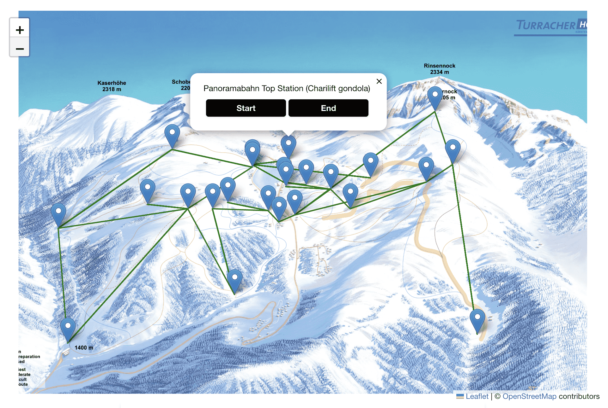
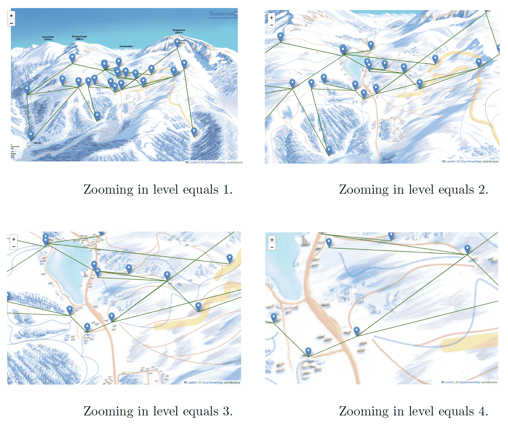

# Software Engineering Group Project

We design a ski web application for skiers. This repository contains the backend and frontend applications for our project.

> In this project, I built the frontend application using React. Our documentation contains detailed information about the project.

We have deployed our project to an online server. Please go to the URL: https://ski-resort-map.vercel.app/.

- Since we are using free tier deployment services, **please note that the backend
takes approximately 50 seconds to run from a cold state**. Thank you very
much for being so understanding!

## Prerequisites

Make sure you have the following installed on your machine:

- Node.js
- Yarn

## Getting Started

### Backend Application

1. Navigate to the `Backend` directory:

    ```bash
    cd Backend
    ```

2. Install the required packages:

    ```bash
    yarn
    ```

3. Run the development server:

    If you have nodemon:

    ```bash
    yarn dev
    ```

    If you don't have nodemon:

    ```bash
    node ./bin/www
    ```

    This will start the backend server.
### Frontend Application

1. Open a new terminal window and navigate to the `Frontend` directory:

    ```bash
    cd ../Frontend
    ```

2. Install frontend dependencies:

    ```bash
    yarn
    ```

3. Run the frontend development server:

    ```bash
    yarn dev
    ```

    This will start the frontend development server.

Now you should have both the backend and frontend servers running.

## System Design (Class Diagram)

<p align="center">

</p>

## Functionality

### Versatile Map

> - The map shows all the ski slopes, lifts, slope endpoints, and lift stations. The edges are drawn using green lines and the nodes are labeled using blue markers.

> - By clicking a marker, we can see the detailed information of that node in a popup.

> - Within a message popup, we are able to select the current node as a start point or a destination point for path-finding.

<p align="center">

</p>

### Find a Path with Preferences

> Start and destination points selection with difficulties.

<p align="center">

</p>

### Available Path Display

> Display a list of available paths.

<p align="center">

</p>

> View the selected path.

> - The selected path from the start point to the end point is shown in a thick red line on the map. Other paths are greyed out to highlight the chosen path.

<p align="center">

</p>

### Versatile Map Zooming Effect

> We built our map with Leaflet which is a JavaScript library for creating interactive maps.

> Our map can be zoomed in and out, and the coordinates of each node and path remain in the same relative position.

<p align="center">

</p>

> I also developed several additional functions: error handling, auto-filling, and mutual exclusion between switch buttons.

## Additional Information

- This project uses Yarn as the package manager.
- Make sure to configure any environment variables if necessary.
